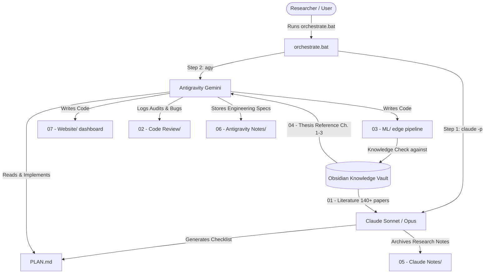
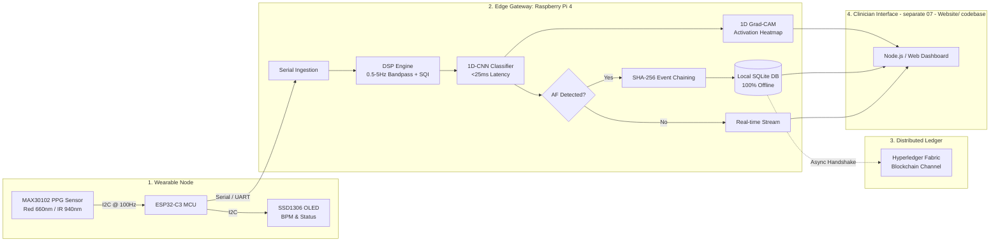

# Dual-Agent System Architecture & Engineering Blueprint

This document defines the technical execution framework, inter-agent operating model, and system architecture for the thesis:
**"An Internet of Things-Based Framework for Cardiac Arrhythmia Detection via Photoplethysmography and Machine Learning"** (University of the East, 3CPE-2A; Adviser: Dr. Nelson Rodelas).

---

## 1. Collaborative Agent Framework: Claude & Antigravity

To ensure rigorous research alignment and clean production-grade code, the project operates under a two-tier AI pair-programming architecture orchestrated via `orchestrate.bat`.



### Agent Roles & Protocol
| Agent | Primary Role | Operational Artifacts | Obsidian Write Target |
|---|---|---|---|
| **Claude (Sonnet/Opus)** | Chief Research Architect & Theory Lead | `PLAN.md`, `CLAUDE.md`, chapter synthesis | `05 - Claude Notes/` & `01 - Literature/` |
| **Antigravity (Gemini)** | Lead Implementation & Systems Engineer | `03 - ML/*` (edge pipeline, firmware), `07 - Website/*` (dashboard), test harnesses, `ANTIGRAVITY.md` | `06 - Antigravity Notes/` & `02 - Code Review/` |

---

## 2. Obsidian as Database, Review Ledger, and Knowledge Check

Obsidian is not merely a note repository; it functions as the **system database, review ledger, and ground-truth knowledge check** for both agents:

1. **Knowledge Check (Epistemic Grounding):**
   - Before implementing DSP or CNN logic, Antigravity consults `[[../01 - Literature/Index|Literature Index]]` (140+ Zotero sources) to verify parameter choices against validated medical literature (e.g. Butterworth filter cutoff ranges from Pereira et al. 2020; IBI extraction from Charlton 2022).
   - Antigravity validates against `[[../04 - Thesis Reference/Thesis Overview|Thesis Overview]]` to ensure absolute fidelity to Chapters 1–3 approved methodology.

2. **Formal Code Review Ledger (`02 - Code Review/`):**
   - Every implementation milestone or refactor executed by Antigravity is audited and documented using `02 - Code Review/_Templates/Code Review Note Template.md`.
   - Every issue is tracked by severity (Critical, Major, Minor), root cause, and remediation status.

3. **Bidirectional State Sync:**
   - Changes, benchmarks, and architectural decisions are persisted in markdown with `[[wikilinks]]`, ensuring that future CLI invocations of both `claude` and `agy` maintain unbroken continuity.

---

## 3. End-to-End System Architecture

The target system integrates five functional tiers designed for resilient operation in non-hospital and primary-care environments (Caloocan City pilot):



**Note (2026-09-03):** the Presentation tier above is `07 - Website/` — a separate
Node.js + HTML5/CSS/JS codebase from `03 - ML/`'s Python edge pipeline, communicating
via a local TCP pub/sub bridge (port 5051), not a shared process. See ADR-001's
"Tier 2b" addendum.

### 3.1. Acquisition & Firmware Tier (ESP32-C3 + MAX30102)
- **Sensor Configuration:** Red (660 nm) and IR (940 nm) LEDs sampled at 100 Hz (10 ms period). Pulse width: 411 $\mu\text{s}$, ADC resolution: 18-bit.
- **Microcontroller:** ESP32-C3 RISC-V core. Operates a rolling ring buffer (512 samples) to ensure zero sample-dropping during OLED I2C bus transactions.
- **Local Alert:** SSD1306 OLED immediately updates local BPM and flashes an alert if consecutive pulse irregularities are detected by on-board heuristic buffers.

### 3.2. Signal Preprocessing & DSP Engine (Raspberry Pi 4)
- **Bandpass Filtering:** 4th-order zero-phase forward-backward Butterworth filter ($0.5\text{ Hz} \le f \le 5.0\text{ Hz}$) suppressing baseline respiratory wander (<0.5 Hz) and high-frequency EMG/fluorescent lighting noise (>5 Hz).
- **Signal Quality Index (SQI):** Rejection of artifact-corrupted windows using:
  - Skewness SQI ($S_{sqi}$): checks asymmetry.
  - Kurtosis SQI ($K_{sqi}$): checks peakedness.
  - Perfusion Index (PI): verifies optical pulsatile amplitude $\frac{AC}{DC} \times 100\%$.
- **Pulse Segmentation:** Two moving-average peak detectors calculate inter-beat intervals (IBI) and instantaneous heart rate (BPM).

### 3.3. Deep Learning & Grad-CAM Explainability Tier
- **1D-CNN Architecture:**
  1. `Input(shape=(1000, 1))` (10-second window @ 100 Hz).
  2. `Conv1D(filters=32, kernel_size=5, padding='same')` + `ReLU` + `MaxPool1D(pool_size=2)`.
  3. `Conv1D(filters=64, kernel_size=3, padding='same')` + `ReLU` + `MaxPool1D(pool_size=2)`.
  4. `Flatten()` -> `Dense(64, activation='relu')` -> `Dropout(0.5)` -> `Dense(1, activation='sigmoid')`.
- **⚠️ Weights status (2026-09-03):** the architecture above is implemented exactly as
  specified, but its weights are randomly initialized, not trained on the MIMIC PERform
  AF Dataset — see [[../02 - Code Review/2026-09-03 - 1D-CNN Inference Model Uses Untrained Random Weights|code review finding]].
  Real training is explicitly deferred per user decision; treat current classification/
  Grad-CAM output as a pipeline demo, not a validated result.
- **Target Latency:** Under 25 ms per inference window on Raspberry Pi 4/5 CPU. **As
  built (2026-09-03):** implemented as a dependency-free pure-NumPy forward pass
  (no TFLite/ONNX runtime) — measured ~13.08 ms, comfortably under budget. TFLite
  FP16/INT8 quantization remains an option if a heavier trained model needs it later,
  but is not currently in use.
- **1D Grad-CAM Explainability:**
  - Extracts the feature importance weights $w_k = \frac{1}{L}\sum_i \frac{\partial y_{AF}}{\partial A_i^k}$ from the final convolutional layer.
  - Generates a 1D relevance mask over the PPG time-series, visually highlighting missing pulse dicrotic notches, varying pulse amplitudes, or erratic beat intervals for clinician verification.

### 3.4. Cryptographic Storage & Hyperledger Fabric Sync
- **Local SQLite DB — ✅ implemented and independently verified:**
  - Guarantees 100% functionality without internet.
  - Each recorded event generates a cryptographic hash chaining `event_id`, `patient_id`,
    `timestamp`, `device_id`, `bpm`, `af_detected`, `confidence`, and `prev_hash`
    (see `03 - ML/storage/db_manager.py`).
  - Creates an immutable local hash chain. Any local tampering invalidates the chain —
    verified via `GET /api/events/verify/chain` and covered by automated tests.
- **Blockchain Synchronization — ⏸️ Planned / Phase 2, not yet built:**
  - `sync_status` exists as a column in the schema (0 = local only, 1 = synced), but no
    Fabric sync worker exists yet — nothing currently flips it. The design below is the
    intended approach once Fabric channel/chaincode details are specified:
  - An asynchronous daemon would check WAN connectivity (`ping` / gateway handshake).
  - On connectivity, uncommitted records (`sync_status = 0`) would be batched into a
    cryptographically signed Fabric transaction and committed to the ledger.
  - Upon transaction endorsement and block commit, `sync_status` would flip to `1`.

---

## 4. Software Quality (ISO/IEC 25010) Verification Roadmap

In adherence to Chapter 3 of the thesis, all code modules implemented by Antigravity will be evaluated against the six ISO/IEC 25010 quality dimensions:

```
┌────────────────────────────────────────────────────────────────────────┐
│           ISO/IEC 25010 Evaluation Scope (status as of 2026-09-03)     │
├──────────────────────────┬─────────────────────────────────────────────┤
│ Functional Suitability   │ TARGET: Sensitivity/Specificity ≥ 90%.      │
│                          │ NOT YET MEASURABLE — model untrained.       │
│ Performance Efficiency   │ MEASURED: Inference ~13ms, sensor→browser   │
│                          │ ~15-28ms. Both within budget.               │
│ Reliability              │ Boot-time systemd auto-restart confirmed    │
│                          │ via reboot test; 24h soak test not yet run. │
│ Security                 │ MEASURED: SHA-256 hash chain (independently │
│                          │ verified), bcrypt auth, RBAC — all working. │
│ Usability                │ Grad-CAM heat-strip renders correctly, but  │
│                          │ its explanations aren't yet clinically      │
│                          │ meaningful (untrained model). SUS untested. │
│ Maintainability          │ Modular code: yes. Automated pytest suite   │
│                          │ for 03 - ML/: NOT YET AUTHORED (JS tests    │
│                          │ for 07 - Website/ exist: 32/32 passing).    │
└──────────────────────────┴─────────────────────────────────────────────┘
```

---

## 5. Sprint Retrospective (as originally planned vs. what was actually delivered)

1. **Sprint 1 — DSP & Simulation Module:**
   - *Planned:* synthetic PPG generator + MIMIC PERform AF dataset loader.
   - *Delivered:* synthetic PPG generator (`SyntheticPPGGenerator` in `runner.py`) —
     the MIMIC PERform dataset loader was **not** built; no offline training happens
     in this codebase yet. Butterworth filter, detrending, peak detection all delivered
     in `03 - ML/signal_processing/` as planned.
2. **Sprint 2 — 1D-CNN & Grad-CAM Model Pipeline:**
   - *Planned:* Keras/PyTorch 1D-CNN trained on Chapter 2 specs, exported to TFLite.
   - *Delivered:* the Chapter 2 architecture implemented as a pure-NumPy forward-pass
     scaffold (`Arrhythmia1DCNN`) with **randomly initialized, untrained weights** —
     no Keras/PyTorch, no training run, no TFLite export. 1D Grad-CAM explainer
     delivered and mathematically correct, but explains an untrained model. See
     [[../02 - Code Review/2026-09-03 - 1D-CNN Inference Model Uses Untrained Random Weights|code review finding]].
3. **Sprint 3 — SQLite Ledger & Hash Chaining:**
   - *Delivered as planned* — `03 - ML/storage/db_manager.py` with SQLite WAL mode and
     SHA-256 chaining. Unit tests exist in JavaScript (`07 - Website/backend/tests/`,
     32/32 passing) rather than a standalone Python suite (`03 - ML/tests/` not yet
     authored).
4. **Sprint 4 — ESP32-C3 Firmware & Edge Ingestion:**
   - *Delivered as planned*, plus real serial ingestion (auto-detect + retry) added to
     `runner.py` on 2026-09-03 (originally the firmware only sent a computed BPM, not
     raw samples — fixed).
5. **Sprint 5 — Clinician Dashboard & Sync Gateway:**
   - *Planned:* Node.js backend + Chart.js dashboard, inside `03 - ML/`.
   - *Delivered:* Node.js backend + hand-built HTML5 Retina Canvas renderer (not
     Chart.js) — and relocated to its own top-level `07 - Website/` codebase per the
     2026-09-03 folder-placement decision, not inside `03 - ML/`. The "Sync Gateway"
     (Hyperledger Fabric) half of this sprint was not built — see §3.4.

---
Back to [[Index|Antigravity Notes Index]] · Back to [[../../Home|Home]]
